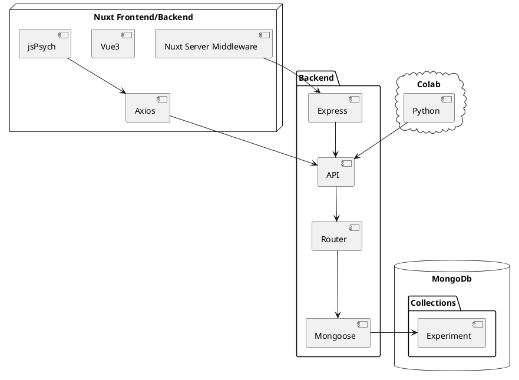

# 當心理學研究遇到前端

心理學 x 前端，在網頁上做心理學實驗

<div class="pt-12">
  <span @click="$slidev.nav.next" class="px-2 py-1 rounded cursor-pointer" hover="bg-white bg-opacity-10">
    Press Space for next page <carbon:arrow-right class="inline"/>
  </span>
</div>

<div class="abs-br m-6 flex gap-2">
  <button @click="$slidev.nav.openInEditor()" title="Open in Editor" class="text-xl slidev-icon-btn opacity-50 !border-none !hover:text-white">
    <carbon:edit />
  </button>
  <a href="https://github.com/slidevjs/slidev" target="_blank" alt="GitHub"
    class="text-xl slidev-icon-btn opacity-50 !border-none !hover:text-white">
    <carbon-logo-github />
  </a>
</div>

<!--
The last comment block of each slide will be treated as slide notes. It will be visible and editable in Presenter Mode along with the slide. [Read more in the docs](https://sli.dev/guide/syntax.html#notes)
-->

---
transition: fade-out
---

# 專案緣起

以前唸心理系，一些課堂會要求做心理學實驗

- 🧑‍💻 要走出門去做實驗，受試者覺得很麻煩
- 📝 短時間要收集大量數據，研究者覺得很麻煩
- 🤹 下雨天刮颱風要出門，大家都覺得很麻煩
- 🛠 用圖形化介面軟體製作實驗，手指好痠，過了一個月後根本不記得怎麼拉出來的

<hr class="my-4"/>


今日介紹

- 心理學實驗：以 Stroop Effect 為例與 Demo
- 專案架構：程式面分享


<!--
You can have `style` tag in markdown to override the style for the current page.
Learn more: https://sli.dev/guide/syntax#embedded-styles
-->

<style>
h1 {
  background-color: #2B90B6;
  background-image: linear-gradient(45deg, #4EC5D4 10%, #146b8c 20%);
  background-size: 100%;
  -webkit-background-clip: text;
  -moz-background-clip: text;
  -webkit-text-fill-color: transparent;
  -moz-text-fill-color: transparent;
}
</style>

<!--
Here is another comment.
-->

---
layout: default
---

# 目錄

<Toc minDepth="1" maxDepth="5"></Toc>


---
layout: image-right
image: /stroop-wiki.png
---

# Stroop effect 叫色測驗

人在認知行為 A 的反應時間，會受其他認知行為 BCD 影響，而變快或變慢

- Stroop effect: 唸出顏色的反應時間，會受到文字的字義影響 [^1][^2]

<div class="pb-16"></div>

[^1]: [Stroop 中文維基](https://zh.wikipedia.org/zh-tw/%E6%96%AF%E7%89%B9%E9%B2%81%E6%99%AE%E6%95%88%E5%BA%94)
[^2]: [佛光大學心理系 叫色實驗](http://www.fgu.edu.tw/~psychology/know/data/exp/09.htm)

---

# 實驗設計與流程

- 3x3 受試者內設計
- 獨變項：
  - 一致性 (3): 一致、不一致、中性 - 實際顏色與素材意涵顏色的一致性
  - 素材類型 (3): 中文、英文、圖片
- 依變項
  - 反應時間: 素材出現到按下按鍵的時間
- 假設
  - 一致性為一致時，反應時間較快；不一致時，反應時間較慢
  - 素材類型為圖片時，一致性對反應時間的影響較低

<div class="mb-8"></div>


---

# Demo 時間

- 實驗網址: <https://psycho-test-nuxt.vercel.app/>
  - 收集的資料: <https://psycho-test-nuxt.vercel.app/api/express/experiment/participant-data?experiment=stroop>
  - 整理的資料: <https://psycho-test-nuxt.vercel.app/api/express/experiment/stroop-data?format=csv>
- colab: <https://colab.research.google.com/drive/19H1IUJ2vCoarNAGTc1w35xvV1odn3hWO>
- 投影片: <https://ayugioh2003.github.io/psycho-test/>
- 專案程式碼: <https://github.com/ayugioh2003/psycho-test>

---

# 專案架構

- 前端、後端、資料庫、Colab

<div class="mt-[-80px]">




</div>

---

# jsPsych

jsPsych is a JavaScript framework for creating behavioral experiments that run in a web browser.[^1]

- 符合實驗流程的程式碼設計
- 許多 plugins (雖然我沒用過)

[^1]: [jsPsych 官方網站](https://www.jspsych.org/7.3/)

```ts
const jsPsych = initJsPsych()
const timeline = []

const instructions = {
  type: jsPsychHtmlKeyboardResponse,
  stimulus: 'welcome!',
 }
timeline.push(instructions)

const hello_trial = { ... }
timeline.push(hello_trial)

const test_procedure = { ... }
timeline.push(test_procedure)

jsPsych.run(timeline)
```

---

# 小結與未來展望

- 前端/實驗軟體/平台部分
  - 因為 jsPsych 有用到 DOM，在 SSR 跟換頁時會有點問題
  - 鍵 RGB 其實不好反應（都靠左手方向），最好換成三個分開帶有顏色的按鈕
  - 多比較各種線上心理學實驗的方案 (lab.js, e-prime, psychoPy ...)
- 後端部分
  - Nuxt3 還是可以搭配 Express 使用，[但找不到用 Express 呼叫 Nuxt3 的正確打開方式] [^1]
  - [在後端處理資料還是有點手工](https://github.com/ayugioh2003/psycho-test/blob/main/packages/nuxt/sub-system/express/router/experiment.ts#L22)，再找看看有沒有現成方案
  - 感覺後端就單純收資料，處理資料的工作可以交給 Python
- 統計部分
  - 看看有沒有少做事情。例如常態性檢定、同質性檢定
  - 本來有想說整合 PyScript，將統計結果放到網站上，但太多 error 就放棄了

[^1]: 
---

# Q & A

<div class="flex justify-center mt-12">

</div>


---
layout: center
class: text-center
---

# 沒惹

感謝聆聽
